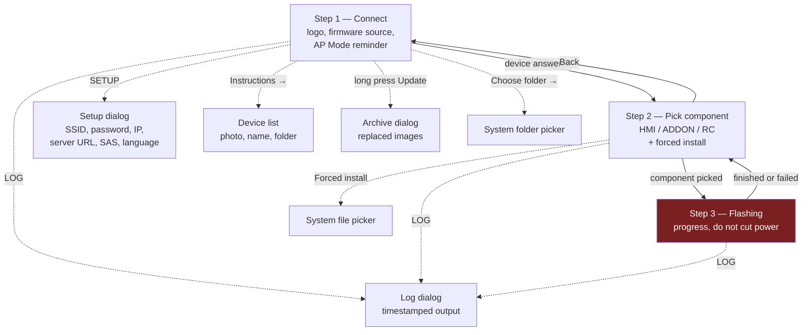
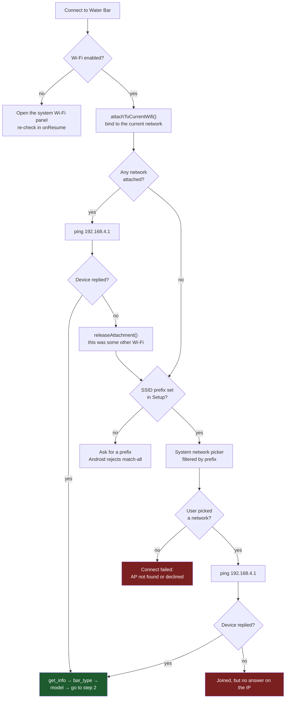
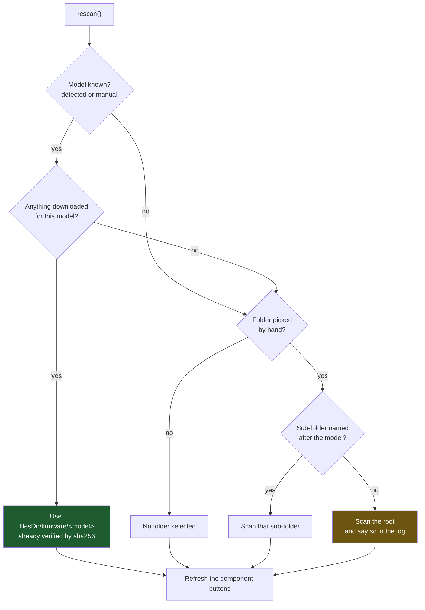
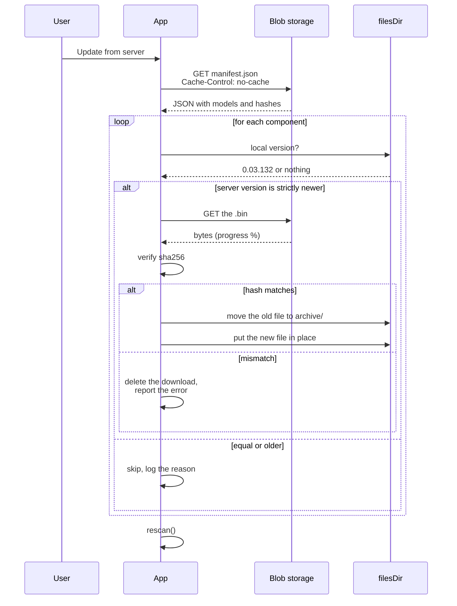
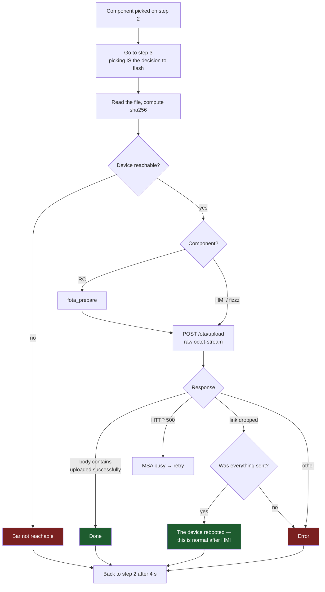
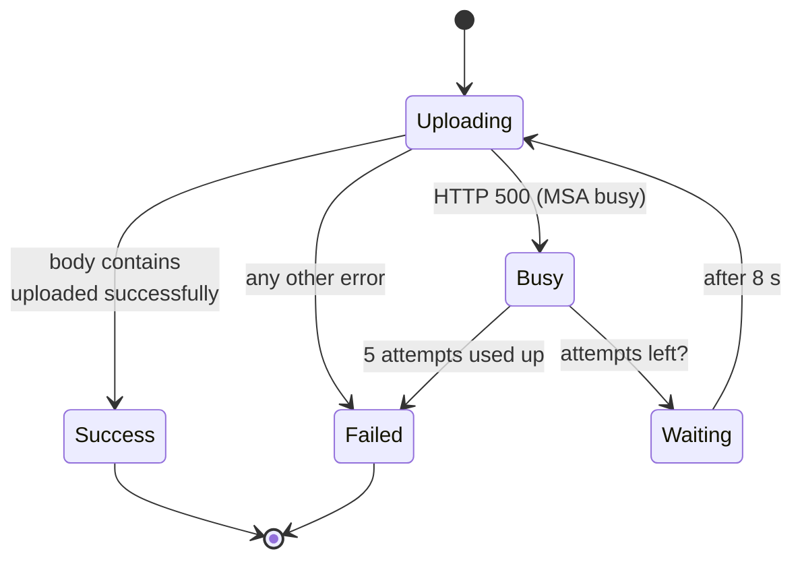
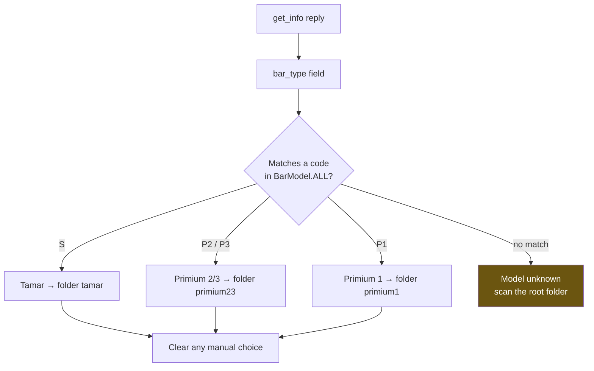
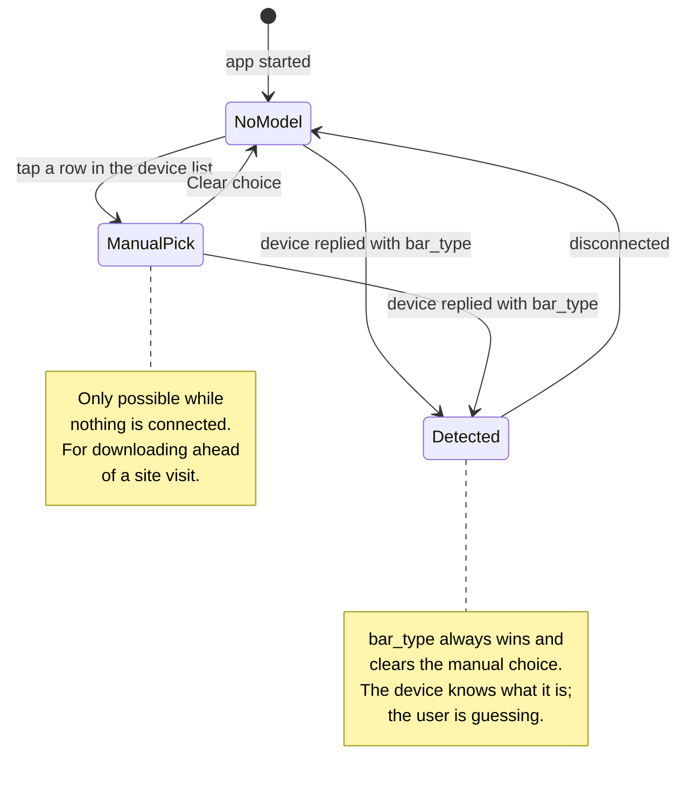
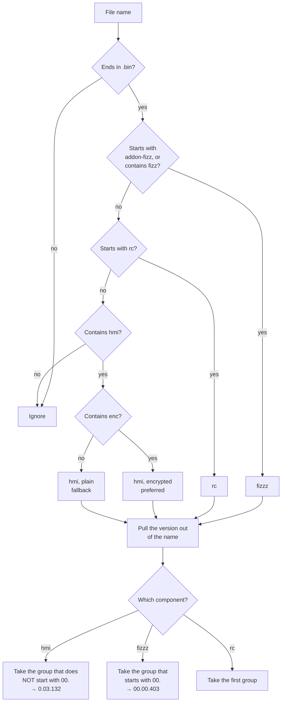
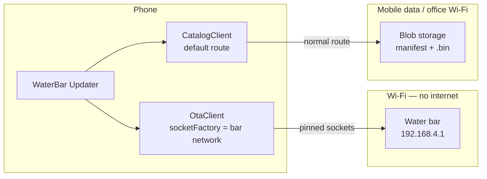

# WaterBar Updater — Flows

Screen storyboard and flow charts for the app.
Diagrams are Mermaid; GitHub renders them directly in the browser.

---

## Contents

1. [Screen map](#1-screen-map)
2. [Connecting to a device](#2-connecting-to-a-device)
3. [Choosing the firmware source](#3-choosing-the-firmware-source)
4. [Updating from the server](#4-updating-from-the-server)
5. [Flashing](#5-flashing)
6. [Retry logic on HTTP 500](#6-retry-logic-on-http-500)
7. [Model detection and manual choice](#7-model-detection-and-manual-choice)
8. [Component and version parsing](#8-component-and-version-parsing)
9. [Network binding](#9-network-binding)

---

## 1. Screen map

Everything lives in one activity. There are no fragments; the wizard steps are
`LinearLayout` blocks whose visibility is toggled by `goTo()`.

Step 3 is marked in red on purpose: it is the only place where the device is
written to, and it cannot be interrupted.

---

## 2. Connecting to a device

Two things worth knowing here.

The first attempt exists because the technician has usually already joined the
network by hand — asking again would be noise.

`removeCapability(NET_CAPABILITY_INTERNET)` does **not** limit the match to
networks without internet. Any Wi-Fi qualifies, office access points included.
The ping is the only real proof.

---

## 3. Choosing the firmware source

Downloaded firmware wins because it was checked against the server's hash. The
hand-picked folder stays as the fallback for a device that is not in the
manifest.

Which source was used goes into the log — "the wrong firmware" must never happen
silently.

---

## 4. Updating from the server

Only strictly newer versions are downloaded, so a deliberate local downgrade is
never undone behind the user's back.

Nothing is ever deleted: the replaced image is moved into `archive/` and stays
there until it is cleared by hand.

**This traffic does not use the bound network.** While the phone is attached to
the device's access point there is no internet on that interface, so the
download goes over office Wi-Fi or mobile data.

---

## 5. Flashing

Success is judged by the **body** of the response, not by the status code.

A dropped link after a full HMI upload is not a failure: the device reboots and
its access point disappears. Telling that apart from "the transfer did not
finish" is what stopped an endless retry loop.

---

## 6. Retry logic on HTTP 500

`HTTP 500` from this device means "the MSA is busy", not "something broke". Up
to 5 attempts, 8 seconds apart.

The countdown is shown on screen so the wait does not look like a freeze.

---

## 7. Model detection and manual choice

Manual selection follows a separate, deliberately narrow path:

---

## 8. Component and version parsing

The version lives only in the file name. Renaming a firmware file breaks the
comparison.

---

## 9. Network binding

Two HTTP clients on purpose. `OtaClient` is pinned to the device's network,
otherwise Android would route its requests through mobile data and they would
never arrive. `CatalogClient` is deliberately left unpinned so downloads work
while the device's access point is still attached.

If `bindProcessToNetwork` is ever introduced, downloads break — the whole
process would be forced onto the bar's network.